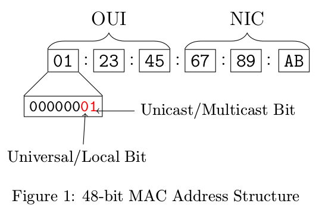

# MAC Address Randomization - Paper summary

[Link to the paper](https://arxiv.org/abs/1703.02874)

## Abstract

* __MAC Address Randomization:__  A privacy technique whereby mobile devices rotate through random hardware addresses in order to prevent observers from singling out their traffic or physical location from other nearby devices.
* However, adoption of this technique has been sporadic and non uniform.
* This paper reviews the various randomization techniques used and identifies flaws in their implementation.

## 1. Introduction

* Smartphones have two major modes of communication which can also be used to track them.
* The first and most obvious is the cellular radio itself.
* However, an often overlooked  avenue for tracking cellphones is the 802.11 (WiFi) radio.
* Every 802.11 radio possesses a MAC address that is a globally unique identifier for that specific WiFi device.
* Any third party eavesdropping on nearby WiFi traffic can uniquely identify nearby cellphones, and their traffic, through
their MAC addresses.

### Probe Requests

* This frame is especially vulnerable to surveillance.
* They continuously broadcast the device's MAC address at a semi-constant rate and thus make tracking trivial.
* Some modern mobile devices make use of temporary, randomized MAC addresses that are distinct from their true global address.
* When probe requests are sent out, they use a randomized pseudonym MAC address that is changed periodically.

### Contributions of the paper

* Develops novel techniques to identify and isolate randomization and randomization schemes from large collections of wireless traffic.
* Presents the first manufacturer and device breakdown for MAC randomization, describing the particular technique each uses.
* Reviews previous techniques for determining global MAC addresses. The techniques were found to be insufficient.
* Provides additional context and improvements to existing passive and active techniques, substantially increasing their
effectiveness.
* Identifies significant flaws in the majority of randomization implementations on Android devices.
* __Discovery and implementation of a control frame attack which exposes the global MAC address for all known devices,regardless of OS, manufacturer, device type, or randomization scheme. Furthermore, Android devices can be susceptible to this attack even when the user disables WiFi and/or enables Airplane Mode.__

---

## 2. Background

### 2.1 MAC Address

* Every NIC on a WiFi capable device has a 48-bit MAC address layer-2 hardware identifier which is designed to be persistent and globally unique.

__How MAC addresses are assigned__

&rarr; In order to guarantee the uniqueness of MAC addresses across devices the IEEE assigns blocks of addresses to organizations in exchange for a fee.  
&rarr; An Organizationally Unique Identifier (OUI), may be purchased and registered with the IEEE, which gives the organization control of and responsibility for all addresses with a particular three-byte prefix. 
&rarr; The manufacturer is then free to assign the remaining low-order three bytes any value they wish when initializing devices, subject to the condition that they do not use the same MAC address twice. 

* The above system implies that give a MAC address, it is trivial to look up the device manufacturer.
* To combat this, the IEEE also provides the ability to purchase a “private” OUI which does not include the company’s name in the register.
* However, this additional privacy feature is not currently used by any major manufacturers.

__Locally assigned addresses__

&rarr; Along with the public and globally unique MAC address, modern devices frequently use locally assigned addresses which are distinguished by a Universal/Local bit in the most significant byte. 
&rarr; Locally assigned addresses are not guaranteed to be unique, and generally are not used in a persistent manner. 
&rarr; Most importantly for this paper, locally assigned addresses may also be used to create randomized MAC addresses as an additional measure of privacy.
&rarr; Similar to an OUI, a three-byte Company Identifier (CID) prefix can be purchased from the IEEE, with the agreement that assignment from this address space will not be used for globally unique applications.
&rarr; The CID always has the local bit set, and is predisposed for use within MAC address randomization schemas.

The discussion of locally assigned addresses above tells us that with the advent of randomized, locally assigned
MAC addresses that change over time, tracking a wireless device is no longer trivial. Probe requests use locally assigned addresses when the device is in a disas sociated state (not associated with an AP). When a mobile device attempts to connect to an AP, however, it reverts to using its globally unique MAC address. As such, tracking smartphones becomes trivial while
they are operating in an associated state.